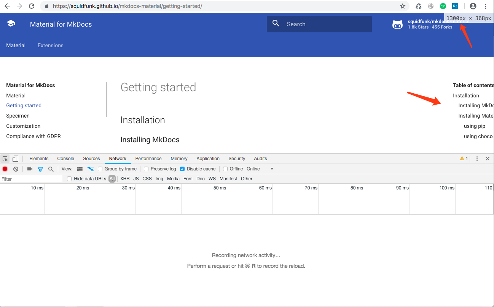

经测试发现，当操作系统为中文语言时，通过chrome浏览器访问，在浏览器的一个固定尺寸范围内，最右边一栏显示会有异常，比如这样

其他浏览器或者操作系统为英文时chrome浏览器也不会出现这种BUG

笔者已将该问题提交给mkdocs-material的原作者，详见
https://github.com/squidfunk/mkdocs-material/issues/911

笔者会将持续跟进该BUG的进展
