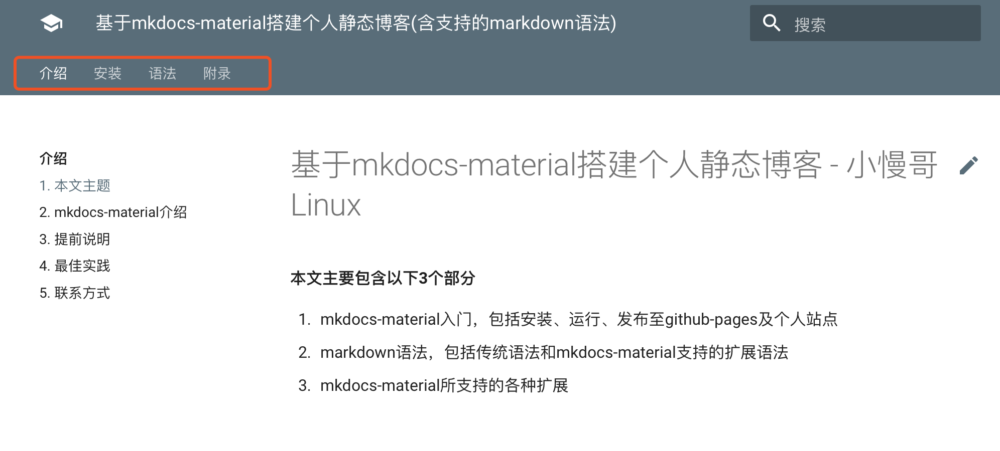
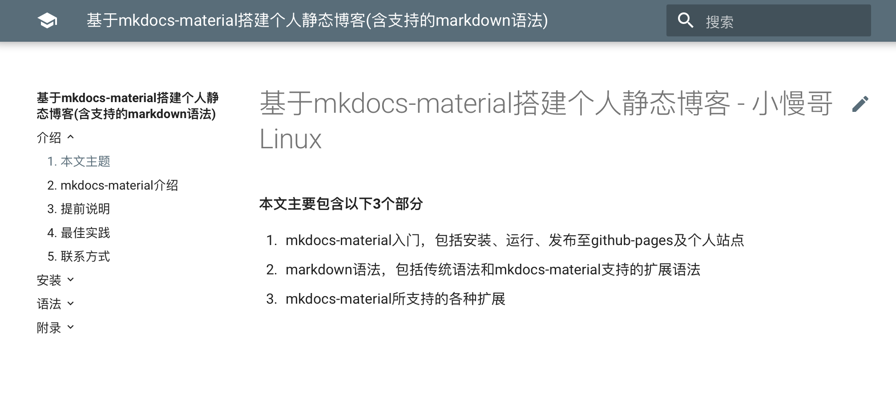

## **开启tab**

---

```yaml
theme:
  name: material
  features:
    - navigation.tabs
    - navigation.tabs.sticky
```



## **关闭tab**

---

```yaml
theme:
  name: material
  feature:
    tabs: false
```


