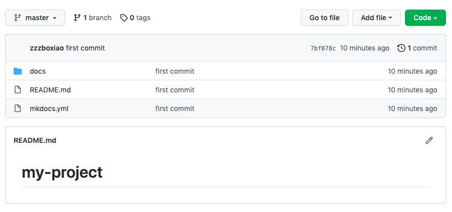

通过`mkdocs gh-deploy`自动编译出html并发布至GitHub pages

## **初始化repo**

---

1. 在github上创建一个repo，名字叫my-project

2. 根据提示将项目repo同步到本地

```text
echo "# my-project" >> README.md
git init
git add README.md
git commit -m "first commit"
git branch -M main
git remote add origin git@github.com:zzzboxiao/my-project.git
git push -u origin main
```

## **导入项目到Github**

---



## **项目部署上线**

---

在本地`my-project/`目录下执行
    
    $ mkdocs gh-deploy
    remote: Resolving deltas: 100% (1/1), done.
    remote: 
    remote: Create a pull request for 'gh-pages' on GitHub by visiting:
    remote:      https://github.com/github_username/my-project/pull/new/gh-pages
    remote: 
    To github.com:github_username/my-project.git
    * [new branch]      gh-pages -> gh-pages
    INFO     -  Your documentation should shortly be available at: https://github_username.github.io/my-project/

## **访问文档网址**
```text
https://github_username.github.io/my-project/
```
